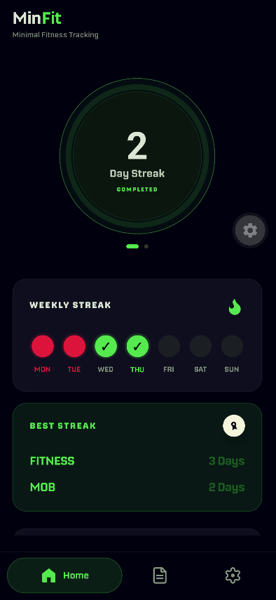
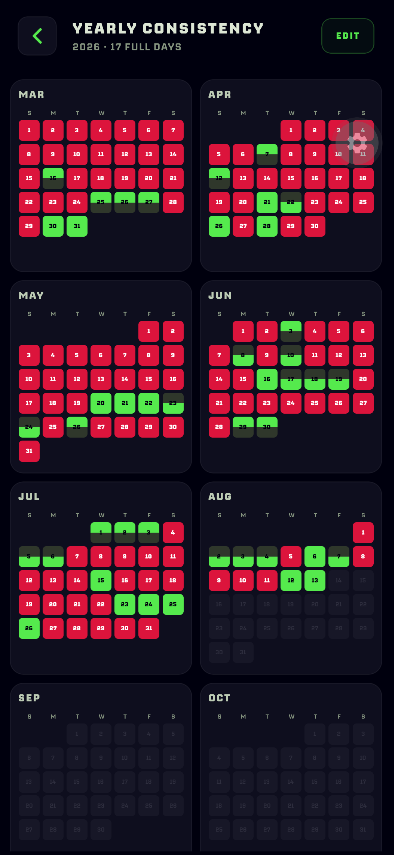

  <kbd>
    
  </kbd>

  <h1>MinFit</h1>

  
A minimal, private fitness tracker mobile app.

  

    
    
    
  

  

    <a href="#features">Features</a> ·
    <a href="#tech-stack">Tech stack</a>
  

---

<table>
  <tr>
    <td width="50%" valign="top">
      

    </td>
    <td width="50%" valign="top">
      

    </td>
  </tr>
</table>

MinFit helps you build two daily habits without accounts, subscriptions, or unnecessary complexity. Your check-ins, streaks, and notes stay on your device.

## Features

- Two-habit check-ins through a swipeable, hold-to-complete orb
- Separate current and best streaks for each habit
- Weekly, monthly, and yearly consistency views
- Editable check-in history with half- and full-day progress
- Private on-device notes with backup and restore

## Tech stack

| Layer | Technology |
| --- | --- |
| Framework | Expo |
| UI | React Native |
| Language | TypeScript |
| Navigation | Expo Router |
| Local storage | AsyncStorage |
| Animation | React Native Reanimated |
| CI/CD | GitHub Actions |

## License

MinFit is available under the [MIT License](LICENSE). Nippo remains subject to its separate Fontshare license.
