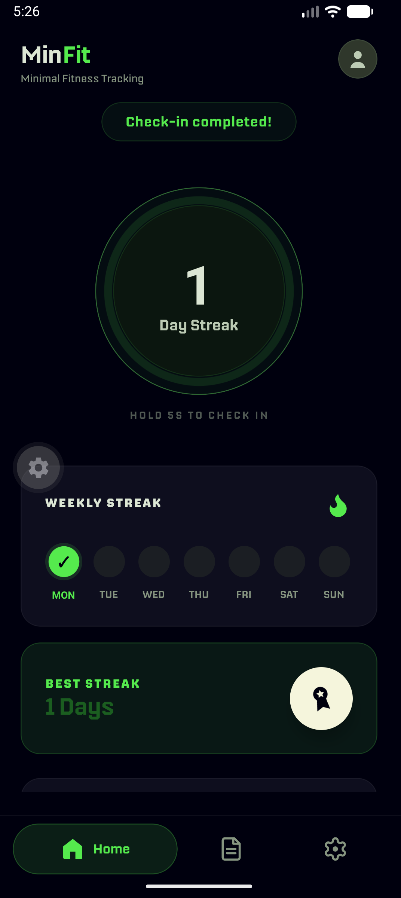

# MinFit


MinFit is a minimal, private-by-default fitness companion for building consistency. It requires no account signup so you can begin as soon as you download it.

<p align="center">
  
</p>

## Features

- One-tap daily check-ins with live and longest-streak tracking
- Monthly consistency calendar
- Private on-device journal with search and rich-text editing
- Settings for app updates and clearing local data

## Tech stack

| Area | Technology |
| --- | --- |
| Framework | Expo SDK 57 |
| UI | React 19, React Native 0.86 |
| Language | TypeScript |
| Navigation | Expo Router |
| Local storage | AsyncStorage |
| Utilities | Day.js, React Native SVG, React Native WebView |
| Typography | Nippo (Fontshare) |

## Run locally

```bash
npm install
npx expo start
```

Use Expo Go or an Android/iOS simulator to open the app. `npm run typecheck` verifies the TypeScript project.

### Font setup

The Nippo font files are intentionally excluded from Git because the included Fontshare EULA prohibits redistributing them. Before running the app, download Nippo under its license and place the extracted bundle at `assets/fonts/Nippo/`; the loader expects files such as `assets/fonts/Nippo/Fonts/OTF/Nippo-Regular.otf`.

## Project structure

```text
app/                 Expo Router screens
src/                 components, hooks, storage, theme, and types
assets/              application icons and local font assets
docs/images/         README images
```

## License

This repository is licensed under the [MIT License](LICENSE). Third-party font files remain subject to their own Fontshare license.
